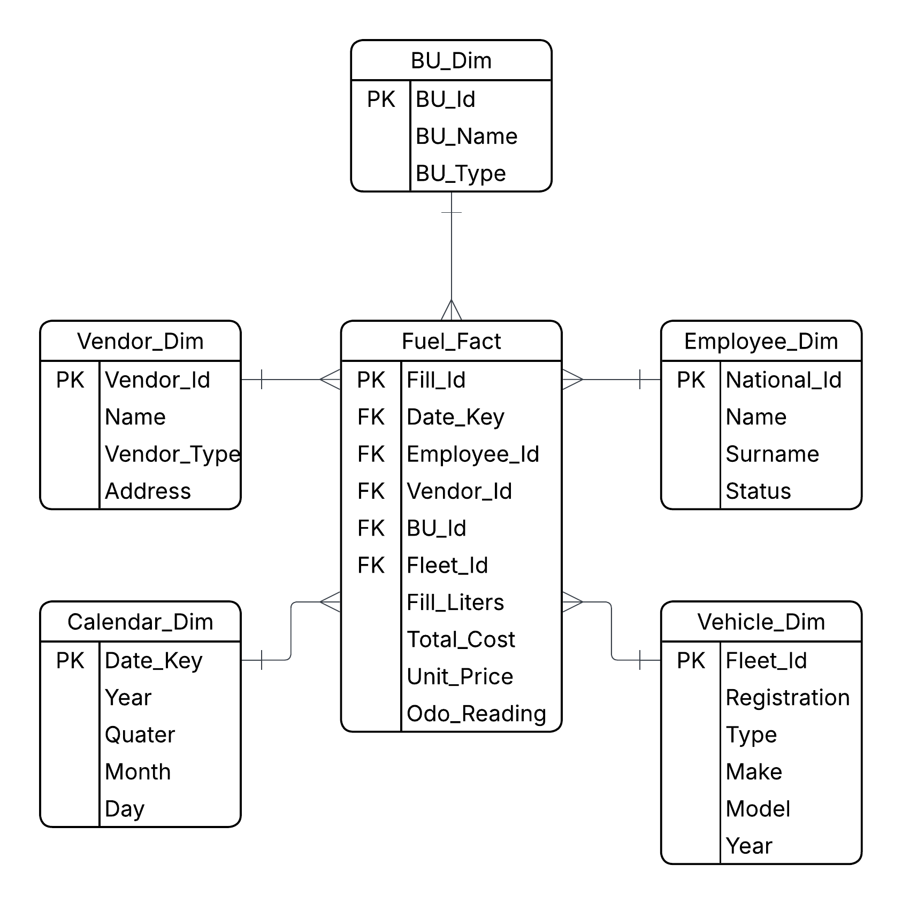
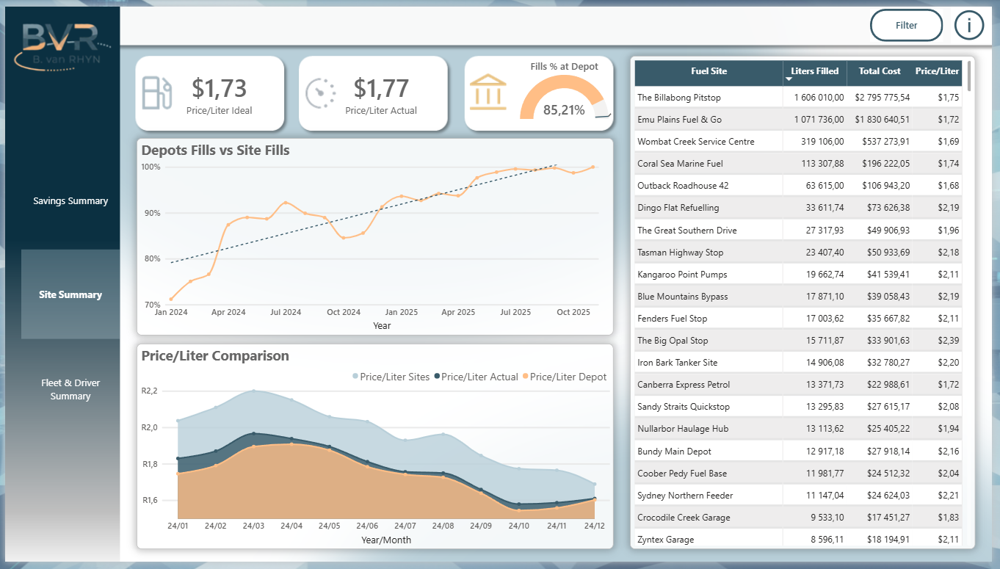
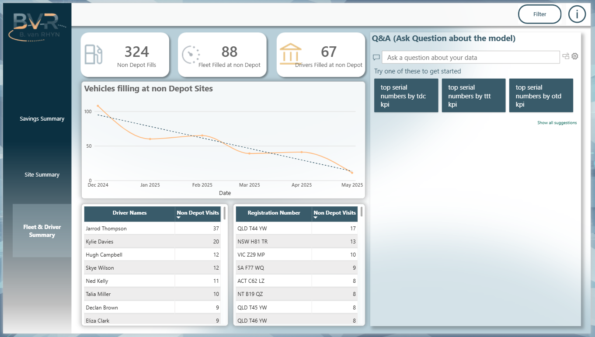

# Fuel Efficiency Optimization Dashboard – Power BI DMAIC + CRISP-DM Case Study

### Objective
This project demonstrates a structured approach to solving business challenges in Power BI by applying a **hybrid methodology** that combines two powerful frameworks:  
- **DMAIC (Define – Measure – Analyze – Improve – Control)** from Continuous Improvement  
- **CRISP-DM (Business Understanding – Data Understanding – Data Preparation – Modeling – Evaluation – Deployment)** from Data Science and Data Mining  

The aim is to use **continuous improvement principles** within **data analytics** to:
- Clearly define the business problem and stakeholder needs (**Define / Business Understanding**)  
- Measure and understand key data sources (**Measure / Data Understanding**)  
- Analyze and model data to uncover inefficiencies (**Analyze / Data Preparation & Modeling**)  
- Implement and evaluate operational improvements (**Improve / Evaluation**)  
- Deploy and sustain data-driven monitoring processes (**Control / Deployment**)  

This hybrid approach ensures both **analytical structure** and **process discipline**, turning business data into actionable insights.  

The case study focuses on **reducing operational fuel costs** by identifying and preventing **non-compliant refueling practices** across a logistics fleet.  
It also provides **insights into driver behavior**, **simulated cost savings** based on historical fuel patterns, and **story-driven visuals** that move beyond reporting to drive decision-making.

---

## Methodology: DMAIC + CRISP-DM Hybrid

The project integrates the **DMAIC continuous-improvement cycle** with the **six CRISP-DM stages** of data analysis to ensure business understanding, analytical rigor, and sustained process improvement.

---

### DEFINE / BUSINESS UNDERSTANDING
Operations reported a growing cost discrepancy between planned and actual fuel expenditure.  
It was discovered that several drivers were refueling at **unauthorized depots** where the **price per liter** was significantly higher than the company’s preferred network.

- **Business Impact**  
  - Fuel price variance up to **$0.50 per liter**  
  - Average fill volume per truck: ~800 L  
  - Potential excess cost per fill: **≈ $400**  
  - With multiple fills per day, this represented a **substantial avoidable expense**

- **Goal**  
  Develop a **Power BI dashboard** that identifies where and when unauthorized fuel fills occur, quantifies financial impact, and enables operations to enforce depot-allocation compliance.

---

### MEASURE / DATA UNDERSTANDING
The data available in the current data structure was analysed in detail.

**Key Steps Performed**
- **Data Profiling in Power Query (Query M):**  
  Used **Column Profile**, **Column Distribution**, and **Column Quality** tools to assess the `FuelFilling_Fact` table.  
  This included identifying **blank values**, **outliers**, and **data inconsistencies**.
- **Data Quality Review:**  
  Investigated missing driver names, inconsistent depot naming, and out-of-range price values to identify data integrity issues.  
- **Data Mapping:**  
  Documented available columns across datasets to fully understand the structure and ensure all relevant data was accessible for analysis.

**Outcome:**  
A validated understanding of data quality and content, ensuring the foundation for accurate and reliable modeling.

**CRISP-DM Alignment:**  
This aligns with the **Data Understanding** phase, where data quality, structure, and anomalies are explored to shape the next step — **Data Preparation**.

---

### ANALYZE / DATA PREPARATION & MODELING
Data was standardized and modeled for analysis using Power Query (M) and DAX.

**Transformations**
- Standardized depot codes and merged transaction tables  
- Calculated authorized vs unauthorized depot fills  
- Built KPIs for:
  - Fuel price variance per fill  
  - Fuel cost per km  
  - Savings opportunity if compliant  

**Analytical Layers**
1. **Depot Cost Analysis** – Owned vs non-owned depot pricing  
2. **Driver Compliance** – % unauthorized fills per driver  
3. **Regional Trends** – Map visuals to identify cost hotspots  

> **Insight Example:**  
> 18 % of total fills occurred at unauthorized depots → estimated monthly overspend ≈ $23 000.

---

### IMPROVE / EVALUATION & DEPLOYMENT
Based on insights, several interventions were implemented:

- Restricted fuel-card access to **approved depots only**  
- Introduced **driver training and accountability** programs  
- Automated **weekly Power BI alert reports** for fleet managers  
- Planned **central depot refueling** for long-haul routes  

> **Operational Outcome:**  
> Within two months, unauthorized depot usage dropped by 72 %, saving an estimated **R 350 000 per month**

---

### CONTROL / MONITORING & CONTINUOUS IMPROVEMENT
To sustain improvements:
- The Power BI dashboard refreshes daily from the operational database  
- Alerts and KPIs are reviewed weekly by the control tower  
- Continuous-monitoring visuals flag any regressions in compliance  

**Control KPIs**
- % of fills at unauthorized depots (target < 5 %)  
- Average fuel price vs benchmark depot  
- Monthly savings trend  

---

## ⚙️ CRISP-DM STAGES SUMMARY
| CRISP-DM Stage | Description | Project Application |
|----------------|-------------|---------------------|
| **1. Business Understanding** | Define objectives and success criteria | Quantify cost savings and improve compliance |
| **2. Data Understanding** | Collect and explore data | Combined fuel, trip, and depot datasets |
| **3. Data Preparation** | Clean and transform data | Power Query transformations for modeling |
| **4. Modeling** | Apply analytical logic | DAX measures for cost variance & savings simulation |
| **5. Evaluation** | Verify insights with stakeholders | Tested KPIs for operational accuracy |
| **6. Deployment** | Deliver and monitor solution | Published Power BI dashboards with automated refresh and alerts |

---

## 🛠 Tools and Techniques
- **Power BI Desktop** – Data modeling & visualization  
- **DAX** – Compliance, variance & savings measures  
- **Power Query (M)** – Data cleaning & transformation  
- **Excel** – Initial validation & comparison  
- **DMAIC + CRISP-DM** – Structured analytical framework  

---
## 🧮 KEY DAX MEASURES
Actual fuel cost after project implementation.
```DAX
M_Current_ActualCost = 
SUMX(
    FILTER(
        Fuel_Fact,
        Fuel_Fact[Date_Key] >= date(2024,12,01)
    ),
    Fuel_Fact[Total Cost]  
)
```
Calculates what the current actual cost would have been if the historic savings rate was applied to the current fuek filling behaviour.
```DAX
M_SimulatedTotalCost = 
([M_Current_ActualCost]/(1-([M_Historic_SavingsRate]-[M_Current_SavingsRate])))
```
Compares the ideal cost (Depot filling cost) based on filling behavior and compares it with the actual cost to determine the savings rate.
```DAX
M_Current_SavingsRate = 
1 - (DIVIDE([M_Current_IdealCost], [M_Current_ActualCost]))
```
Calculates what the current total cost would be if fuel was only filled in depots
```DAX
M_Current_IdealCost = 
SUMX(
    FILTER(
        Fuel_Fact,
        Fuel_Fact[Date_Key] >= date(2024,12,01)
    ),
    Fuel_Fact[Fill_Liters] * [M_Current_DepotRate]
)
```
Compares the Historic ideal cost (Depot filling cost) based on filling behavior and compares it with the actual cost to determine the historic savings rate.
```DAX
M_DS_Historic_SavingsRate = 
1-(DIVIDE([M_Historic_IdealCost],[M_Historic_ActualCost]))
```
Calculates what the Historic total cost would have beeen if fuel was only filled in depots, before that optimization project has kicked off.
```DAX
M_DS_Historic_IdealCost = 
SUMX(
    FILTER(
        Fuel_Fact,
        Fuel_Fact[Date_Key] < date(2024,12,01)
    ),
   Fuel_Fact[Fill_Liters] * [M_Historic_DepotRate]
)
```
Calculates what the Historic depot fuel pirce per liter was.
```DAX
M_Historic_DepotRate = 
AVERAGEX(
    FILTER(
        Fuel_Fact,
        Fuel_Fact[Date_Key] < DATE(2024, 12, 01) &&
        Vendor_Dim[Vendor_Type] = "Depot"
    ),
    Fuel_Fact[Fill_Liters]
)
```
> 💡 These formulas simulate what current costs would have been under ideal fueling behavior and quantify the impact of continuous improvement.
---
## DATA MODEL (STAR SCHEMA)


**Fact Table: **

- Fuel_Fact – fuel fill details, cost, volume

**Dimensions:**

- Vendor_Dim – fuel depot and supplier details

- Driver_Dim – driver and vehicle mapping

- Date_Dim – daily refresh and time intelligence support

- Trip_Dim – trip-level operational details

---
## Report WALKTHROUGH
### 1. Savings Summary Overview


**Highlights:**

- Displays total fuel cost vs simulated cost

- Shows savings rate trend over time

- Quantifies monetary value of improvement
> 💡 Example Insight: “Current savings rate: 17.3%, representing R 350 000 monthly avoided cost.”

### 2. Filter Functionality


**Highlights:**

- Indicates bookmark filter panel fucntionality.


### 3. Site Summary


### 4. Fleet Summary

---

